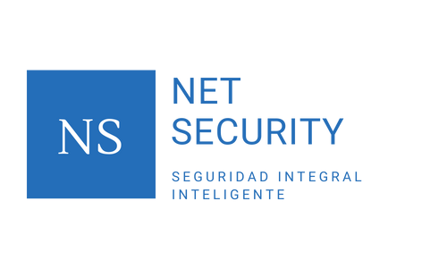

<a name="readme-top"></a>

<!-- PROJECT LOGO -->
<br />
<div align="center">
  <a href="https://github.com/GabrielPenise/netglobal">
    
  </a>

<h3 align="center">APLICACION NET SECURITY</h3>

  <p align="center">
    Proyecto profesional para bootcamp Plataforma 5 con la colaboración de Net Global Solutions S.A.
    <br />
    <a href="https://github.com/GabrielPenise/netglobal"><strong>Explora nuestro proyecto »</strong></a>
    <br />
    <br />
    <a href="https://netglobal.tech/">Empresa colaboradora Net Global</a>
  </p>
</div>

<!-- TABLE OF CONTENTS -->
<details>
  <summary>Contenido</summary>
  <ol>
    <li>
      <a href="#sobre-el-proyecto">Sobre el proyecto</a>
      <ul>
        <li><a href="#stack-de-tecnologías">Stack de tecnologías</a></li>
      </ul>
    </li>
    <li>
      <a href="#empezando">Empezando</a>
      <ul>
        <li><a href="#pre-requisitos">Pre-requisitos</a></li>
        <li><a href="#instalación">Instalación</a></li>
      </ul>
    </li>
    <li><a href="#metodos-de-api">Metodos de API</a></li>
    <li><a href="#roadmap">Roadmap</a></li>
    <li><a href="#contacto">Contacto</a></li>
  </ol>
</details>

<!-- ABOUT THE PROJECT -->

## Sobre el proyecto


"Net Security" es un proyecto de Certificación de servicios vigiladores, desde la cual una empresa puede gestionar y controlar la presencia de vigiladores dentro de sus distintas sucursales.

El sistema dispone de dos aplicaciones bien diferenciadas:

- La primera es una capa de gestión web responsive desde la cual se administran los datos de los clientes, sus locales a vigilar, los datos de los vigiladores y sus horarios de trabajo. Con toda esa información disponible un administrador del sistema asigna manualmente los distintos lugares y horarios de trabajo de cada vigilador para los próximos días.
- El segundo módulo del sistema se trata de una aplicación PWA/mobile que será utilizada por cada vigilador para asegurar su presencia en su puesto de trabajo a lo largo de su jornada laboral. Ello será posible a través del solicitar al vigilador la carga de un formulario que registrará en el momento de la carga la posición geográfica del empleado.

<p align="right">(<a href="#readme-top">volver a arriba</a>)</p>

### Stack de tecnologías

#### Back

- NodeJS
- Nodemon
- Express
- Sequelize
- Postgres
- Morgan
- Cors
- Bcrypt
- JWT
- Dotenv
- Nominatim
- Moment
- Nodemailer
- Handlebars

#### Front

- Axios
- Vite
- React
- React Calendar
- React Leaflet
- Redux
- Moment
- OpenStreetMap
- React-HTML-Table-To-Excel
- Sweetalert
- React-Bootstrap
- Bootstrap
- SASS
- CSS
- Fontawseome Icons

#### App Mobile

- React Native
- Expo
- Axios
- Redux

<p align="right">(<a href="#readme-top">volver a arriba</a>)</p>

<!-- GETTING STARTED -->

## Empezando

Actualmente la base de datos se encuentra totalmente de manera local. Por lo tanto, deberás seguir estas instrucciones para levantar el proyecto de backend.

### Pre-requisitos

Deberas complir los siguientes pre-requisitos para poder utilizar este proyecto

- DB: Crea la DB utilizando psql
  ```sh
  createdb net_security
  ```

### Instalación

1. Clona el repositorio en tu local
   ```sh
   git clone https://github.com/GabrielPenise/netglobal
   ```
2. Instala las dependencias NPM (respectivamente en carpeta back y carpeta front)
   ```sh
   npm install
   ```
3. Seedea la base de datos (carpeta back)
   ```sh
   npm run seed
   ```
4. Levanta el servidor (carpeta back)
   ```sh
   npm start
   ```
5. Levanta la web (carpeta front)
   ```sh
   npm start
   ```

<p align="right">(<a href="#readme-top">volver a arriba</a>)</p>

<!-- API  -->

## Metodos de API


Puedes ver todos los metodos de la API descargando la [colección de POSTMAN](https://api.postman.com/collections/23456074-2e3d1240-065c-49e1-920a-08b67206f18e?access_key=PMAT-01GJ3QPVXRJ21FHKRF4B0MB1TG)

<p align="right">(<a href="#readme-top">volver a arriba</a>)</p>

<!-- ROADMAP -->

## Roadmap

<!-- WEB -->

- [ ] Aplicación Web
  - [x] Login/Logout
  - [x] Persistencia de usuario
  - [x] Panel alta clientes
  - [x] Panel alta sucursales de un cliente
  - [x] Panel alta vigiladores
  - [x] Calendario y asignación de turnos
  - [x] Calendarios por vigilador
  - [x] Calendarios por sucursal
  - [-] Otros
    - [x] Mapa validación localización sucursales y vigiladores
    - [-] Reporte de sucursales con horarios sin cubrir
    - [-] Reporte de horas trabajadas por vigilador

<!-- MOBILE -->

- [ ] Aplicación Móvil
  - [x] Login/Logout
  - [x] Persistencia de usuario
  - [x] Fichaje horario entrada y salida
  - [x] Registrar geoposicionamiento entrada y salida
  - [-] Otros
    - [-] Consulta días y horarios próximas direcciones de trabajo
    - [-] Cargar avisos de ausencias en su calendario
    - [ ] Consultar cantidad de horas trabajadas
    - [ ] Aviso en horario aleatorio de carga de formulario durante horario de trabajo
    - [ ] Captura de imagen en el momento de registrar geoposicionamiento

<p align="right">(<a href="#readme-top">volver a arriba</a>)</p>

<!-- CONTACT -->

## Contacto

- Gisela Arroyo Galarce- ...@gmail.com
- Carmela Cacabelos - ...@gmail.com
- Gabriel Penise - ...@gmail.com
- Alberto Carrillo de Comas - albertokarri@gmail.com
- Gerardo Burgos - ...@gmail.com

Link del proyecto: [https://github.com/GabrielPenise/netglobal](https://github.com/GabrielPenise/netglobal)

<p align="right">(<a href="#readme-top">volver a arriba</a>)</p>
